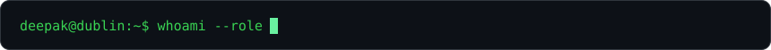

<picture>
  <source media="(prefers-color-scheme: light)" srcset="./tagline-light.svg">
  
</picture>

 

  

<h3><code>deepak@github ~ $ ./contributions.sh</code></h3>
<picture>
  <source media="(prefers-color-scheme: light)" srcset="./contrib-heatmap-light.svg">
  
</picture>

  

<h3><code>deepak@github ~ $ whoami</code></h3>
<table>
  <tr>
    <td valign="top">
      <picture>
        <source media="(prefers-color-scheme: light)" srcset="./ascii-portrait-light.svg">
        
      </picture>
    </td>
    <td valign="top">
      <picture>
        <source media="(prefers-color-scheme: light)" srcset="./info-card-light.svg">
        
      </picture>
    </td>
  </tr>
</table>

 

<h3><code>deepak@github ~ $ git log career</code></h3>
<picture>
  <source media="(prefers-color-scheme: light)" srcset="./career-log-light.svg">
  
</picture>

  

<h3><code>deepak@github ~ $ pip list</code></h3>
<picture>
  <source media="(prefers-color-scheme: light)" srcset="./toolkit-light.svg">
  
</picture>

  

Built with <a href="https://github.com/deepakshebani/animated-github-profile">animated-github-profile</a>: pure SVG, refreshed daily by GitHub Actions.

